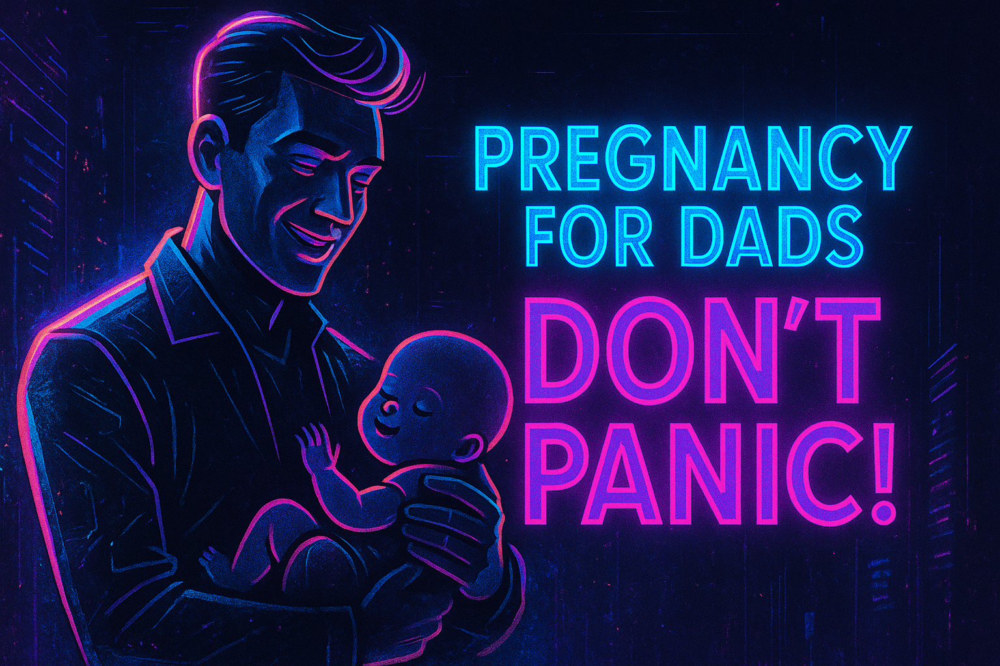

# The Hitchhiker's Guide to Pregnancy

> **⚠️ WORK IN PROGRESS ⚠️** - This project is actively being developed. Content is being added and refined regularly.

Pregnancy is challenging and full of myths. It would be great if she would be pregnant on even days and pass it to me on odd ones (pun intended!). However, biology does not allow me to be THAT supportive. The second-best thing might be understanding how and when to help. This project collects research-based information to guide expecting fathers — and mothers — through pregnancy.

Main lesson so far: Mostly of the recommendations for an healthy lifestyle are also true for a healthy pregnancy. Don't freak out, most decisions are not on matters of life and death. Exercises lead to healthier a mother - pregnant or not! Limiting alcohol consumption is recommended for everyone, washing veggies is the hygenic thing to do before eating them... Pregnancy might raise the stakes, but on 80% of what I read, the advice for pregnant woman is the same as for everyone else, just adjusted for the risk.

All information is based on scientific research with references provided.

## Table of Contents

Topics are added without prioritization.

1. [Acochol](alcohol.md)

### Methodology
- [Methodology Lessons](methodology_lessons.md)
- Context prompts:
  - Context for when asking LLMs to search for [scientific evidence](context/researcher_mode.md);
  - Context for asking for comments from LLMs on my [notes](context/notes_mode.md);
  - Context for keeping a light and [humorous tone](context/humour_mode.md);

### Archive

Do not take the information from the archive on its face value. The content has not gone through systematic review, was considered irrelevant, or has been duplicated into other files. The files are kept in the archive in case the information is useful in the future.

## Topics to be reseaerched
1. Oster mentions ABCDX classification of drugs by FDA, are there other entities that are trust worthy and worth looking at?
2. Are there exercises that help reduce period cramps? (happy wife, happy life, more precisely: less cranky wife, fewer miserable days during her period.)
3. Oster mentions that Bed Rest makes more harm than good. How to handle a doctor that prescribes bed rest?
4. Extend the alcohol section to include alcohol impacts on breast feeding.

## Contributing

Contributions to this project are warmly welcomed! As a work in progress, there are many ways you can help:

- Adding new research-based information
- Improving existing content
- Correcting errors or outdated information
- Suggesting new topics to cover
- Providing feedback on the structure and organization

If you'd like to contribute, please feel free to open an issue or submit a pull request.

---

*Helping dads-to-be support their partners through the journey of pregnancy, one fact at a time.*

**NOTE**: _this is not medical advice, use it at your own risk._
