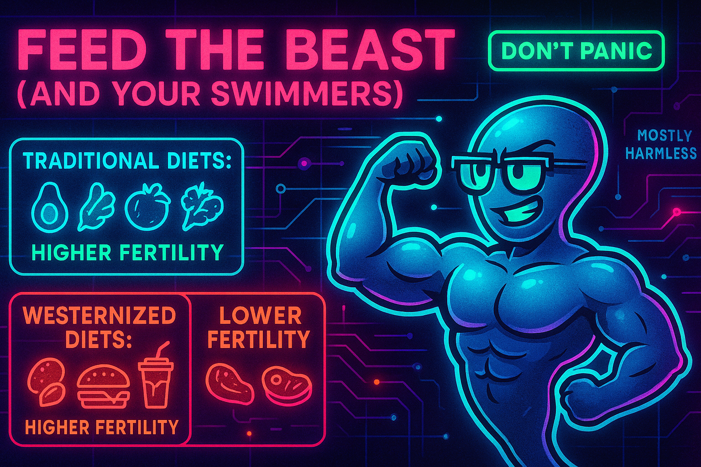

## Feed the beast (and your swimmers)

Welcome to the food court of fertility! Here's your delicious, science-backed tour of our alimentation articles. From Mediterranean magic to vegetarian verdicts, we've got the scoop on what to put on your plate to boost those baby-making odds. Spoiler alert: your mom was right about eating your vegetables.

*Note: the image is wrong, weternized diets lead to lower fertility!*

- [Dietary Habits and Male Fertility](alimentation/dietary_habits_male_fertility.md) — fuel for your swimmers
  - **TL;DR**: Your diet can make or break your swimmers' performance. A Mediterranean-style diet with plenty of fruits, vegetables, nuts, and fish can boost your sperm count by nearly 7 million per milliliter and improve motility by almost 6%. On the flip side, processed meats and ultra-low-fat diets can tank your testosterone levels and hurt your chances. Think of it as fuel for your reproductive engine - you wouldn't put cheap gas in a Ferrari, so don't feed your boys junk food.

- [Dietary Habits and Female Fertility](alimentation/dietary_habits_female_fertility.md) — what she eats matters too
  - **TL;DR**: What she eats can make or break her chances of getting pregnant. A Mediterranean-style diet can boost her fertility by 22% and increase live birth rates by 25%. Weight loss in obese women can dramatically improve ovulation, and folic acid supplementation is a no-brainer - it's been proven to reduce birth defects and may help with conception. Her body is doing the heavy lifting, so feed it right.

- [Vegetarian Diet and Male Fertility](alimentation/vegetarian_diet_male_fertility.md) — the plant-based reality check
  - **TL;DR**: Work in progress.

- [Dietary Habits and Fertility by Region](alimentation/dietary_habits_and_fertility_per_region.md) — around the world in 80 meals
  - **TL;DR**: Traditional diets rich in vegetables, whole grains, fish, and legumes support fertility, while Westernized diets high in processed foods, red meat, and sugars harm reproductive health. The Mediterranean diet has the strongest evidence, but many traditional regional diets share similar fertility-supporting patterns. The key is avoiding processed foods and embracing traditional, plant-forward eating patterns with moderate fish and healthy fats. Your grandmother's cooking was probably better for your fertility than that drive-through burger.

## The Big Picture

The science is crystal clear: **what you both eat directly impacts your baby-making potential**. The Mediterranean diet is the rock star here, consistently showing benefits for both male and female fertility. But here's the kicker - most traditional diets around the world share the same fertility-supporting characteristics: lots of plants, whole grains, healthy fats, and minimal processing.

**The fertility-friendly formula:**
- **Fruits and vegetables** (your mom was right)
- **Whole grains** (not the white stuff)
- **Fish and healthy fats** (olive oil, nuts, seeds)
- **Legumes and beans** (cheap protein that works)
- **Minimal processing** (if it comes in a box with 47 ingredients, skip it)

**The fertility-killing culprits:**
- **Processed meats** (sorry, bacon lovers)
- **Ultra-processed foods** (if it has a cartoon mascot, be suspicious)
- **Excessive red meat** (moderation is key)
- **Refined sugars and carbs** (white rice, white bread, white lies about portion sizes)

## Regional Wisdom

Turns out your ancestors knew what they were doing. Traditional diets from the Mediterranean to the Amazon share common fertility-supporting patterns. The global shift toward Westernized diets has led to dramatic fertility declines (Saudi Arabia: 68% decline, China: 69% decline). Maybe it's time to go back to grandma's recipes instead of the drive-through.

## Bottom Line

Your reproductive system is like a high-performance engine - it needs quality fuel to run at its best. Feed it junk, and you'll get junk results. Feed it the good stuff, and you might just get the good stuff back. The Mediterranean diet is your best bet, but any traditional, minimally processed diet rich in plants and healthy fats will do the trick.

Remember: you are what you eat, and apparently, so are your swimmers. Choose wisely, future dad.

---

*Note: This document presents scientific evidence on dietary habits and fertility but does not constitute medical advice. Individuals should consult with their healthcare providers for personalized guidance regarding diet and fertility.*
