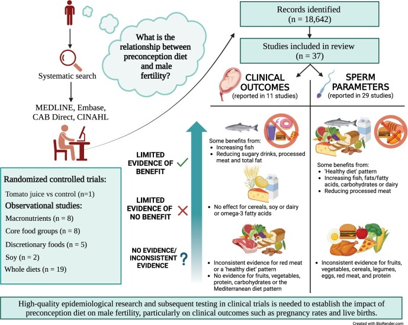

# Dietary Habits and Male Fertility

> **The Gist**: Your diet can make or break your swimmers' performance. A Mediterranean-style diet with plenty of fruits, vegetables, nuts, and fish can boost your sperm count by nearly 7 million per milliliter and improve motility by almost 6%. On the flip side, processed meats and ultra-low-fat diets can tank your testosterone levels and hurt your chances. Think of it as fuel for your reproductive engine - you wouldn't put cheap gas in a Ferrari, so don't feed your boys junk food.

Your eating habits play a crucial role in your reproductive health, and the science is pretty clear: what you put on your plate directly impacts what your swimmers can do. While your partner might be the one carrying the baby, your contribution to the conception process is heavily influenced by your diet. The good news? Making smart food choices can significantly improve your fertility odds.

## The Game Plan: What Science Says About Diet and Male Fertility

The research consistently shows that **healthy dietary patterns are your best bet for optimal sperm quality**. Think Mediterranean-style eating: lots of fruits, vegetables, whole grains, nuts, fish, and olive oil. This isn't just about looking good for the beach - it's about giving your reproductive system the nutrients it needs to function at its best.

The evidence is particularly strong for:
- **Mediterranean diet patterns**: Associated with better sperm concentration, count, and motility
- **Weight management**: If you're overweight, losing weight can dramatically improve your sperm quality
- **Antioxidant-rich foods**: Help protect your sperm from damage
- **Avoiding processed meats**: These can negatively impact your fertility

## Most relevant (and reviewed) studies

### 1. Systematic Review: Healthy Dietary Patterns and Male Semen Quality (2024)

* **Study Design**: Systematic review and meta-analysis of six cross-sectional studies
* **Sample Size**: 1,244 men total
* **Key Findings**: Men with high adherence to healthy dietary patterns (Mediterranean-style diets) showed significant improvements in:
  - Sperm concentration: +6.88 million sperm/ml (95% CI: 1.26-12.49 million/ml; P < 0.05)
  - Total sperm count: +16.70 million (95% CI: 2.37-31.03 million; P < 0.05)  
  - Progressive sperm motility: +5.85% (95% CI: 2.59%-9.12%; P < 0.01)

This comprehensive analysis found that healthy dietary patterns significantly improve multiple semen parameters. The researchers noted that these diets typically include high consumption of fruits, vegetables, whole grains, legumes, nuts, and fish - basically the opposite of the typical "guy diet" of pizza and beer.

**Limitations**: Cross-sectional design means we can't prove causation, only association. Also, the studies relied on self-reported dietary intake, which can be unreliable.

**Citation**: [Nutrition Evidence (2024)](https://pmc.ncbi.nlm.nih.gov/articles/PMC9491032/)

### 2. Systematic Scoping Review: Preconception Diet and Male Fertility (2024)

**Study Design**: Systematic scoping review of preconception diet and male fertility
**Sample Size**: 37 studies (1 RCT, 36 observational studies)
**Key Findings**:
- **Mediterranean Diet**: Consistently associated with improved sperm parameters across multiple studies
- **Healthy Dietary Patterns**: Higher adherence to healthy eating patterns (HEI, aHEI, DASH) linked to better sperm concentration and morphology
- **Processed Meat**: Higher consumption associated with poorer semen quality parameters
- **Dairy Products**: Mixed evidence - some studies show benefits, others show negative associations
- **Omega-3 Fatty Acids**: Positive associations with sperm quality parameters
- **Antioxidant-Rich Foods**: Fruits, vegetables, and nuts consistently associated with better sperm parameters

**Critical Limitations**:
- **Only 1 randomized controlled trial** studied a rather limited intervention. Drinking tomato juice for 12 weeks improves semen parameters in infertile men. [Yumamoto et al. 2017](https://apjcn.qdu.edu.cn/26_1_10.pdf)
- **36 observational studies** cannot establish causation, only associations
- **Heterogeneous study designs** and dietary assessment methods limit comparability
- **Limited focus on clinical outcomes** - most studies measured semen parameters only

**Conclusion**: While dietary patterns show consistent associations with sperm quality, the evidence base is weak for clinical fertility outcomes due to lack of high-quality RCTs.

**Citation**: [Tully et al. 2024](https://pmc.ncbi.nlm.nih.gov/articles/PMC11063564/)

### 3. Systematic Review: Mediterranean Diet and Male Fertility (2024)

* **Study Design**: Systematic review and meta-analysis
* **Sample Size**: Multiple studies included up to October 2024
* **Key Findings**: Higher adherence to Mediterranean diet was positively associated with improved semen quality parameters, 
  - Sperm count increased by 24 milion,
  - Progressive motility improved by 7.5%
including increased sperm concentration and motility.

The Mediterranean diet continues to show strong associations with better reproductive health. This diet emphasizes olive oil, fish, nuts, fruits, vegetables, and whole grains while limiting red meat and processed foods.

**Citation**: [PubMed (2024)](https://pmc.ncbi.nlm.nih.gov/articles/PMC12276387/)

### 4. Meta-Analysis: Low-Fat Diets and Testosterone Levels (2022)
:warning: in review :warning:
* **Study Design**: Systematic review and meta-analysis of intervention studies
* **Sample Size**: 6 studies with 206 participants total
* **Key Findings**: Low-fat diets were associated with significant decreases in:
  - Total testosterone: SMD = -0.38 (95% CI: -0.75 to -0.01; P = 0.04)
  - Free testosterone: SMD = -0.37 (95% CI: -0.63 to -0.11; P = 0.005)

This study suggests that **very low-fat diets might hurt your testosterone levels**, which are crucial for sperm production. The researchers noted that dietary fat is important for hormone production, so cutting it too drastically could backfire.

**Limitations**: Small number of studies included, and the effect sizes were modest.

**Citation**: [arXiv (2022)](https://arxiv.org/abs/2204.00007)

### 5. Systematic Review: Antioxidant Supplementation and Male Fertility (2023)

* **Study Design**: Systematic review
* **Key Findings**: Adequate intake or supplementation of antioxidants (vitamins C and E, selenium, zinc) can be effective in preventing and treating male infertility by improving semen parameters

Antioxidants help protect sperm from oxidative stress, which can damage DNA and impair function. The review found that these nutrients can improve various semen parameters, though the authors noted that more high-quality randomized controlled trials are needed.

**Citation**: [MDPI (2023)](https://www.mdpi.com/2076-3921/12/4/836)

## Conclusion

The scientific evidence shows **consistent associations between dietary habits and sperm quality parameters**, but the relationship to actual fertility outcomes remains uncertain. The most comprehensive review to date (Tully et al. 2024) found:

**Strong evidence for sperm quality improvements:**
- **Mediterranean-style diets** consistently associated with better sperm parameters
- **Healthy dietary patterns** (HEI, aHEI, DASH) linked to improved sperm concentration and morphology
- **Antioxidant-rich foods** (fruits, vegetables, nuts) associated with better sperm quality
- **Weight loss in obese men** can dramatically improve sperm concentration

**Areas of uncertainty:**
- **Only 1 RCT** has tested actual fertility outcomes (pregnancy/live birth)
- **Processed meat effects** show mixed evidence across studies
- **Dairy consumption** has conflicting associations in different studies

**The practical takeaway**: While we can't definitively prove that diet improves pregnancy rates, the consistent associations with sperm quality suggest that eating a Mediterranean-style diet rich in fruits, vegetables, whole grains, nuts, and fish while limiting processed foods is a reasonable approach for men concerned about fertility. The evidence is strongest for improving semen parameters, but we need more high-quality trials to confirm effects on actual conception success.

*Note: This document presents scientific evidence on dietary habits and male fertility but does not constitute medical advice. Men with fertility concerns should consult with healthcare providers for personalized guidance.*
