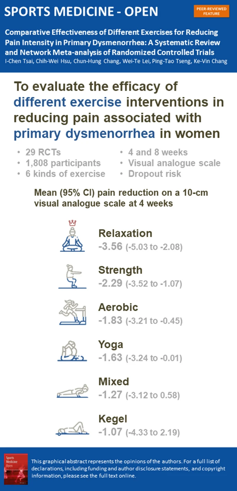

# Exercises to Relieve Menstrual Cramps

> **The Gist**: All types of exercise, including relaxation, strength training, aerobic activity, yoga, and mixed exercises, are effective in reducing menstrual pain. Relaxation exercises appear to be the most effective and have the lowest dropout rates. Even a few sessions a week can make a difference.

Menstrual cramps, or primary dysmenorrhea, are a common issue for many women. While pain relievers are a go-to solution, research shows that exercise can be a powerful, drug-free alternative for managing the pain. This document summarizes the scientific evidence on which exercises are most effective.

## The Science Behind Exercise and Menstrual Pain

Exercise is thought to help with menstrual cramps in a few ways. It can increase blood flow, which helps to flush out prostaglandins, the hormone-like substances that cause uterine muscle contractions. Exercise also releases endorphins, which are natural painkillers and mood elevators. Additionally, certain exercises can help to relax the muscles in the pelvic region, further easing cramps.

## Most Relevant (and Reviewed) Studies

Two recent systematic reviews and network meta-analyses provide a comprehensive overview of the effectiveness of different exercise interventions for primary dysmenorrhea.

### 1. Tsai et al. (2024): Comparative Effectiveness of Different Exercises

This systematic review and network meta-analysis of 29 randomized controlled trials (1808 participants) found that all tested exercise interventions were effective in reducing menstrual pain after 8 weeks. The study compared relaxation exercises, strength training, aerobic activity, yoga, mixed exercises, and the Kegel maneuver.

*   **Key Findings**:
    *   All exercise types were effective in reducing pain at 8 weeks.
    *   **Relaxation exercises** were the most effective at both 4 and 8 weeks.
    *   Relaxation exercises also had the lowest dropout rate, suggesting they are a more sustainable option for many women.

[[1]](https://sportsmedicine-open.springeropen.com/articles/10.1186/s40798-024-00718-4)

### 2. Zheng et al. (2024): A Deeper Dive into Exercise Regimens

This network meta-analysis of 49 studies (3129 participants) also found that all six types of exercise interventions (aerobic, core-strengthening, resistance, multi-component, mind-body, and stretching) had a positive influence on managing primary dysmenorrhea. The study provided more detailed insights into the optimal exercise regimens.

*   **Key Findings**:
    *   **Resistance exercise** and **multi-component exercise** showed statistically significant reductions in pain intensity.
    *   **Multi-component exercise** and **stretching** were best for reducing overall menstrual symptoms.
    *   **Core-strengthening** and **multi-component exercise** were most effective at reducing the duration of pain.
    *   For exercise durations exceeding 8 weeks, **resistance exercise** was the most effective.
    *   1 to 3 sessions per week of **multi-component exercise** and **aerobic exercise** showed great benefits.

[[2]](https://pmc.ncbi.nlm.nih.gov/articles/PMC11569607/)

## Conclusion

The scientific evidence strongly supports the use of exercise to manage menstrual cramps. While all types of exercise appear to be beneficial, **relaxation exercises** stand out as a particularly effective and easy-to-stick-with option. For those looking for more variety, a **multi-component exercise** program that includes a mix of aerobic, strength, and stretching exercises is also highly recommended. The key is to find an activity you enjoy and can do consistently. Even a few sessions a week can provide significant relief from menstrual pain.

*Note: This document presents scientific evidence and does not constitute medical advice. Individuals should consult with their healthcare providers for personalized guidance.*

